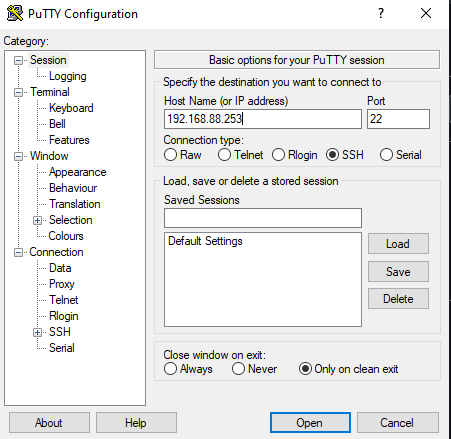
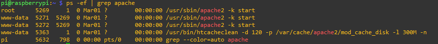

# Raspberry - Servidor apache

Este proyecto esta realizado con la intención de crear un servidor con la raspberry, en el implementaremos apache, mysql, php, java, etc.<br/>
Esta sección será meramente teórica y practica. Nos saltaremos los pasos de tener un escribir una ISO en la tarjeta SD para la raspberry.
<br/>
Iniciamos con la conexion en local del "servidor".<br/>

<br/>
Instalamos y configuraremos el servidor web más famosos de todos "Apache", iniciamos con la actulización del sistema e instalamos apache2.
Usaremos <b>apt</b> ya que es el gestor de paquetes de software de la raspberry pi.<br/>

```bash

    pi@raspberrypi:~ $ sudo apt-get update
    pi@raspberrypi:~ $ sudo apt-get upgrade
    pi@raspberrypi:~ $ sudo apt-get install apache2

```

Al instalar el programa se crean archivos de configuración, de usuario y grupo <b>www-data</b>, estos ejecutan los procesos de Apache que atienden las peticiones.<br/>
Se crean un directorio <i>/var/www/html</i> propietario y grupo <b>root</b><br/><br/>
Comprobamos que el servidor apache esta iniciado, este escucha en el puerto :80/TCP

```bash
    pi@raspberrypi:~ $ ps -ef | grep apache

```

<br/>

<br/>
