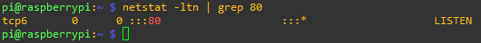
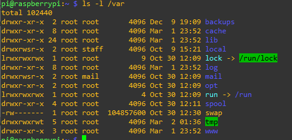
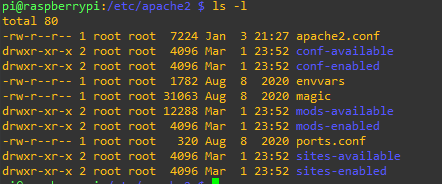

# Raspberry - Servidor web Apache v2

Este proyecto esta realizado con la intención de crear un servidor con la raspberry, en el implementaremos apache, mysql, php, java, etc.<br/>
Esta sección será meramente teórica y practica. Nos saltaremos los pasos de tener un escribir una ISO en la tarjeta SD para la raspberry.
<br/>
Iniciamos con la conexion en local del "servidor".<br/>

<br/>
Instalamos y configuraremos el servidor web más famosos de todos "Apache", iniciamos con la actulización del sistema e instalamos apache2.
Usaremos <b>apt</b> ya que es el gestor de paquetes de software de la raspberry pi.<br/>

```bash

    pi@raspberrypi:~ $ sudo apt-get update
    pi@raspberrypi:~ $ sudo apt-get upgrade
    pi@raspberrypi:~ $ sudo apt-get install apache2

```

## Comprobaciones necesarias

Para verificar la instalacion de apache nos dirigiremos a la CLI y escribimos <b>apacha2 -v</b>, se nos debería de mostrar la version de apache.<br/>
Al instalar el programa se crean archivos de configuración, de usuario y grupo <b>www-data</b>, estos ejecutan los procesos de Apache que atienden las peticiones.<br/>
Se crean un directorio <i>/var/www/html</i> propietario y grupo <b>root</b><br/><br/>
Comprobamos que el servidor apache esta iniciado, este escucha en el puerto :80/TCP

```bash
    pi@raspberrypi:~ $ ps -ef | grep apache

```

<br/>
<center>

</center>
<br/>

Verificamos que la conexion es exitosa en el puerto http:80. Usaremos <i>netstat</i> esta muestra un listado de conexiones activas en el hosts, las opciones son <b>-l</b> listening (escucha), <b>-t</b>
TCP, <b>-u</b> UDP, <b>-n</b> numeric.
<br/>

```bash
    pi@raspberrypi:~ $ netstat -ltn

```

<br/>
<center>

</center>
<br/>
Otras maneras de verificar que apache se esta ejecutando usaremos este comando.

```bash
    pi@raspberrypi:~ $ sudo systemctl status apache2
    #En caso de que no este corriendo (normalmente siempre esta ejecutandose en segundo plano)
    #Ejecutaremos el siguiente comando
    pi@raspberrypi:~ $ sudo systemctl start apache2

```

<br/>
Comprobamos las carpetas del directorio <i>/var</i> (este contiene datos variables como registro del sistema), usando el comando <b>ls</b> se nos debería de mostrar un listado de los archivos. Como este por ejemplo:<br/>
<center>

</center>
<br/>

## Fichero de configuración

En esta apartado veremos los fichero de configuración del servidor web Apache. Accedemos al directorio <b>/etc/apache2</b> (/etc contiene archivos de configuracion de todos los programas)y listamos dicho contenido.
<br/>

<center>

</center>
<br/>
